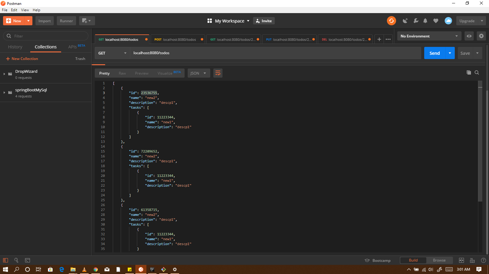
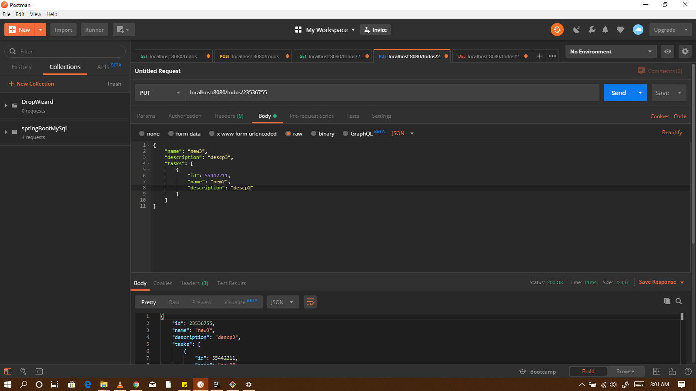

# DropwizardService

## How to start the DropwizardService application
---

1. Run `mvn clean install` to build your application
1. Start application with `java -jar target/dropwizard-service-1.0-SNAPSHOT.jar server config.yml`
1. To check that your application is running enter url `http://localhost:8080`

## Apis
---
| API                            | Description                                                                |
| ------------------------------ | -------------------------------------------------------------------------- |
| `/todos`                       | GET - All Todos                                                            |
| `/todos`                       | POST - Adds Todo                                                           |
| `/todos/{id}`                  | GET - Gets Todo with the Id                                                |
| `/todos/{id}`                  | PUT - Overwrites Todo with the given id and Todo                           |
| `/todos/{id}`                  | DELETE - Deletes Todo with the given ID                                    |

## Screen Shots

| GET Todos                                      | PUT Todo                                       |
| ---------------------------------------------- | ---------------------------------------------- |
|     |     |
